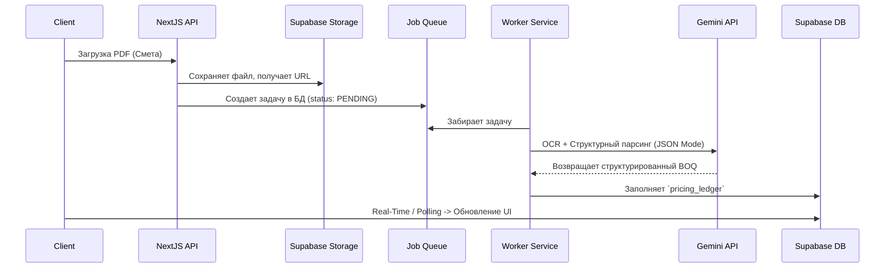

# Архитектурная справка (Architecture Breakdown)

Проект использует подход **Clean Architecture** с четким разделением слоев для обеспечения надежности, масштабирования и независимости компонентов AI-генерации.

## 1. Стек технологий
- **Frontend / Client:** React 19, Next.js 16 (App Router), TailwindCSS v4, TypeScript.
- **Backend / Database:** Supabase (BaaS: Auth, PostgreSQL, Storage, Row Level Security).
- **Background Worker:** Node.js Express Server (работает автономно для тяжелых задач).
- **AI / LLM:** Google Gemini API (`gemini-3-flash-preview`).

## 2. Глобальная структура данных (Supabase)
Ключевые таблицы и связи (RLS Policies настроены на изоляцию по `contractor_id`):
1. **`profiles`** - данные пользователя (продрядчика), расширяющие `auth.users`.
2. **`projects`** - контейнеры проектов подрядчика.
3. **`documents`** - загруженные PDF, чертежи, спецификации.
4. **`contradictions`** - найденные нестыковки из модуля *Contradiction Radar*.
5. **`pricing_ledger`** - база расценок (смета) проекта, расчет сумм без НДС.

## 3. Топология взаимодействия потоков

### А. Модуль AI Estimator (Извлечение Смет)

### Б. Модуль Contradiction Radar (Анализ конфликтов)
Радар сравнивает документы из категории `CONTRACT` с документами `EXECUTION`. Процесс может занимать время, поэтому он асинхронный:
1. Пользователь выбирает 2 документа для сканирования.
2. Next.js отправляет путь файлов в `src/worker.ts`.
3. Worker извлекает текст/изображения и скармливает Gemini с промптом: "Найди несоответствия и оцени риски (HIGH, MEDIUM, LOW)".
4. Результат пишется в таблицу `contradictions` и отображается пользователю.

## 4. Экспорт и Цены (Ledger & Pricing)
- Цены в системе (`total_price_excl_vat`) **всегда** считаются без учета НДС (ללא מע"מ).
- **Hard Rule:** НДС = 18%.
- Формирование CSV происходит через `api/export` (Next JS Route Handler), с прикрепленным BOM-символом `\uFEFF` для корректной поддержки иврита в Excel.
- Генерация PDF происходит на стороне клиента через `utils/pdfGenerator.ts`, где происходит окончательный расчет (Цена * 1.18). Расчеты НДС должны быть выровнены для соблюдения финансового комплаенса.
